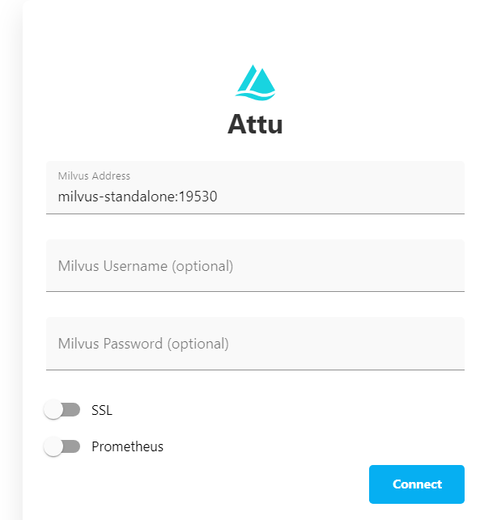

## 文件目录结构：

```
project
	bakStage
	data
		位置①：放一个模型文件
		dataEmbedding
			位置②：放一个嵌入的模型文件
			...
		decoupling
			processJsonandcallLLMx.0.py 	//要运行的文件
			application.yaml  				//配置文件
		Milvus
			docker-compose.yaml
		outedatacode
		templatebaichuan.jinja 				//这是模型对话用的模板文件
	modules
	nginx.conf
	reception
```


## 使用步骤：

1. 将项目拉下来后，先把里面的data文件夹放到文件系统的根目录 

2. 我们去**官网** [huggingface.co](https://huggingface.co/baichuan-inc/Baichuan2-7B-Chat/tree/main) 下载的模型放到指定位置下（大模型放在位置①哪个位置，就是**我们放到根目录的data文件夹**的里面），嵌入**模型**[BAAI/bge-large-zh · Hugging Face](https://huggingface.co/BAAI/bge-large-zh)也放到指定**位置**(位置②，就是**我们放到根目录的data文件夹**下的dataEmbedding文件夹下)

3. 安装好python的依赖：

   ```python
   sentence_transformers
   bitsandbytes        
   transformers  
   sentencepiece  
   accelerate                 
   Flask               
   flask_cors    
   xformers（加速训练的，可选）   
   pymilvus   
   langchain   
   langchain-community   
   pypdf  
   ```

    **缺失的待会再根据报错加上**

4. `cd Milvus` 然后运行 `docker-compose up -d` 创建Milvus的实例

   我们等待四个容器跑起来后，访问 本地的8000端口可以得到

   

   看见上面的图片而且命令行所有实例的日志都没问题就说明milvus启动成功了

5. 运行大模型

   ```bash
   python -m vllm.entrypoints.openai.api_server \
           --model /data/你下载的模型的文件夹名字  \
           --served-model-name ds \
           --trust-remote-code \
           --chat-template /data/templatebaichuan.jinja  \
           --dtype half  \
           --port 8849
   ```

   *--model：模型的位置*

   *--served-model-name：自定义的模型名字，在vllm启动后根据这个来区分模型，（可以在源代码看见发起请求时需要带这个名字，这里要和/data/decoupling下的application.yaml的配置文件的llm.name字段一致，默认是ds）*

   *--chat-template：这个是模型问答时的模板*

   *--dtype half：使用单精度浮点数，显存不够时可用*

   *--port 8849：模型监听的端口，对应application.yaml下的llm.port*

   运行起来后可以看见一些常见的端口：

   ```bash
   INFO 12-09 07:43:11 launcher.py:27] Route: /openapi.json, Methods: GET, HEAD
   INFO 12-09 07:43:11 launcher.py:27] Route: /docs, Methods: GET, HEAD
   INFO 12-09 07:43:11 launcher.py:27] Route: /docs/oauth2-redirect, Methods: GET, HEAD
   INFO 12-09 07:43:11 launcher.py:27] Route: /redoc, Methods: GET, HEAD
   INFO 12-09 07:43:11 launcher.py:27] Route: /health, Methods: GET
   INFO 12-09 07:43:11 launcher.py:27] Route: /tokenize, Methods: POST
   INFO 12-09 07:43:11 launcher.py:27] Route: /detokenize, Methods: POST
   INFO 12-09 07:43:11 launcher.py:27] Route: /v1/models, Methods: GET
   INFO 12-09 07:43:11 launcher.py:27] Route: /version, Methods: GET
   INFO 12-09 07:43:11 launcher.py:27] Route: /v1/chat/completions, Methods: POST
   INFO 12-09 07:43:11 launcher.py:27] Route: /v1/completions, Methods: POST
   INFO 12-09 07:43:11 launcher.py:27] Route: /v1/embeddings, Methods: POST
   ```

6. `cd /data/decoupling` 然后运行 `python processJsonandcallLLM2.0.py `

7. reception是前端的，先进入.env文件，确保里面有url地址的地方全部和第六步运行flask程序的地址和端口是一致的(除了上面有#attu注解的，这个注解下的ip和端口是第4步milvus的ip和端口)。然后运行 `npm install` 再运行` npm start` 就可以启动前端

8. 下载nginx，然后将项目下的nginx.conf 替换原来的nginx的配置文件（在nginx的安装目录下/conf，这个是配置），这个配置文件是对前端`reception/src/hall/homePage.tsx` 文件的 104 行左右的  \<iframe>标签的代理。

9. backStage是java写的后端，可以直接运行

10. 对于application.yaml配置文件，里面modules.embedding.bge是词向量模型的路径（位置②）如果你把他放在其他地方就修改这里。


## 效果展示：

-->
   
)
